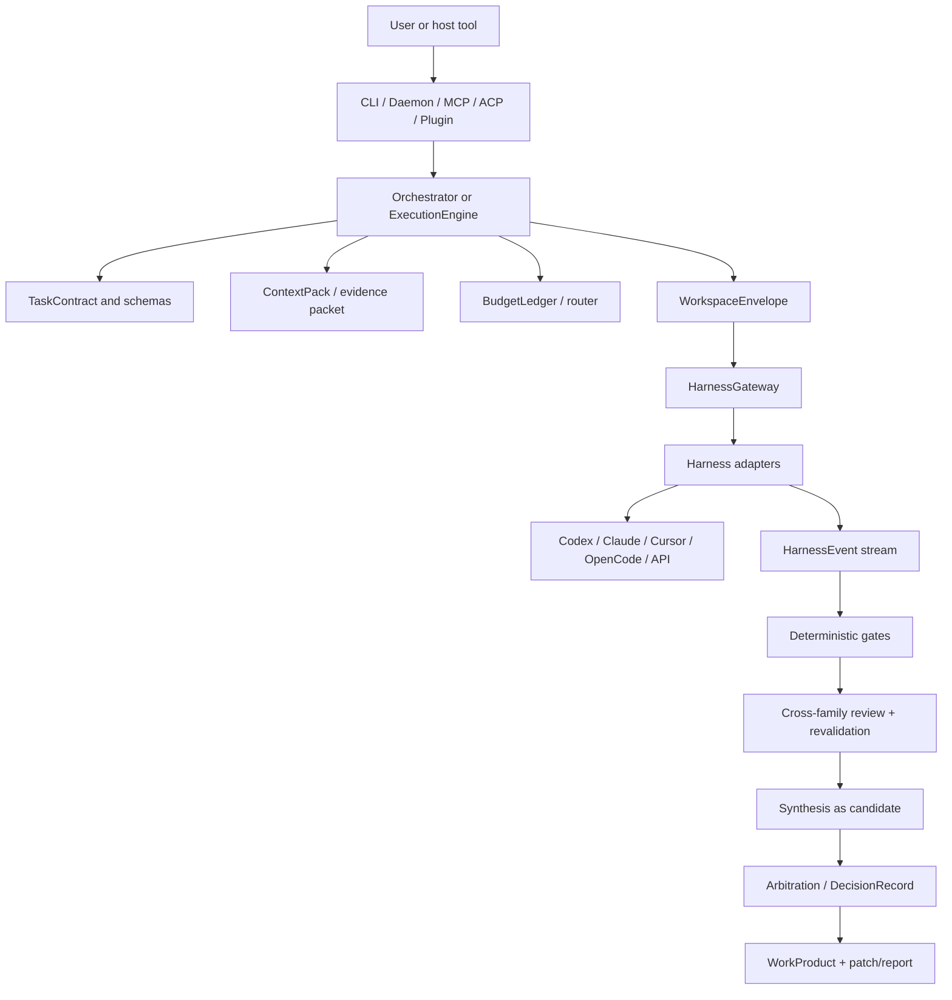

# Claudex v0.1.0 - Architecture Reference

This document is the operational map of the current Claudex codebase: package
boundaries, data flow, artifact layout, and the invariants that future work
should preserve. It is not a changelog and not a replacement for
[`SPEC.md`](SPEC.md). The spec describes the intended system; this file describes
how the current v0.1 implementation is organized and where to make changes.

---

## 1. What Claudex Is

Claudex is a local-first control plane over external coding harnesses: Codex
CLI, Claude Code, Cursor CLI, OpenCode, raw APIs, and future adapters. A harness
is not a role. Roles are expressed as intents such as `plan`, `implement`,
`repair`, `review`, `compare`, `synthesize`, `audit`, and `benchmark`.

The design goal is interchangeable harnesses behind one typed contract:

```text
surface -> orchestrator/core -> gateway -> harness adapter -> native tool/API
        <- typed events/artifacts/reviews/budget/WorkProduct <-
```

If only one harness is configured, Claudex should collapse to that harness plus
structured artifacts and policy. If multiple harnesses are configured, Claudex
can run tournaments, cross-review candidates, synthesize fixes, and arbitrate
with evidence.

---

## 2. High-Level Flow



Daily mode uses the minimal `ExecutionEngine` path. Race, convergence, planning,
and audit modes use `Orchestrator`.

---

## 3. Package Map

### Contracts and primitives

- `packages/schema`: Zod schemas and TypeScript types. This is the SSOT for
  contracts such as `TaskContract`, `HarnessManifest`, `HarnessRunSpec`,
  `HarnessEvent`, `WorkspaceEnvelope`, `WorkProduct`, findings, budgets, and
  decisions. JSON Schema generation lives here.
- `packages/util`: IDs, timestamps, hashing, safe file reads/writes, redaction.
- `packages/config`: layered config loading and repo-local config init.

### Core execution

- `packages/core`: adapter interface, typed errors, process spawning helpers,
  conformance doctor helpers, and the minimal single-harness `ExecutionEngine`.
- `packages/orchestrator`: high-level modes (`best_of_n`, `max_attempts`,
  `until_convergence`, `plan`, `readonly_swarm`, `benchmark/create` race path).
- `packages/workspace`: git worktree envelopes, dirty-tree policy, scoped
  harness config dirs, port allocation, diff capture, cleanup.
- `packages/gateway`: harness discovery, capability-to-intent gating, status,
  default available-harness resolution.

### Harness boundary

- `packages/harness-codex`: Codex CLI adapter. Runs `codex exec --json`,
  translates JSON stream events, and seeds API-key auth into isolated
  `CODEX_HOME` when needed.
- `packages/harness-claude`: Claude Code adapter. Runs `claude -p` with
  `stream-json` output and translates events.
- `packages/harness-cursor`, `packages/harness-opencode`: local CLI adapters
  for additional harnesses.
- `packages/harness-raw-api`: raw API-backed review/planning harness.
- `packages/harness-fake`: deterministic harness suite for tests.
- `packages/adapter-protocol`: JSON-RPC over stdio protocol for external
  adapters in any language.

Adapters translate native streams into typed Claudex events. They do not choose
winners, manage budgets, or decide policy.

### Review, policy, and selection

- `packages/review`: deterministic gates, patch-apply checks, cross-family
  route proof, finding parsing/deduplication, finding revalidation, convergence
  predicate, readiness ledger, review engine.
- `packages/arbitration`: evidence-first ranking and `DecisionRecord`.
- `packages/synthesis`: decides whether synthesis is worthwhile and builds a
  synthesis prompt/plan.
- `packages/policy`: risk classification and path/command policy helpers.
- `packages/budget`: leases, spend ledger, quota/rate-limit observations,
  portfolio routing.
- `packages/secrets`: keychain/file-backed secret store and secret resolution.

### Storage and surfaces

- `packages/event-log`: append-only JSONL event log.
- `packages/artifact-store`: `.claudex/runs/<run_id>` directory management.
- `packages/delivery`: patch checking and apply/commit/branch/PR delivery.
- `packages/cli`: user CLI, command dispatch, adapter registry, plugin install,
  release name checks.
- `packages/daemon`: optional local Unix-socket JSON-RPC daemon.
- `packages/mcp-server`: MCP stdio server exposing Claudex tools.
- `packages/acp-server`: ACP stdio session agent.
- `packages/benchmark`: SWE-bench Verified prediction runner plus benchmark
  scaffolds.

---

## 4. Main Execution Paths

### Daily

`claudex run "..."` calls the minimal `ExecutionEngine`. It creates a run
artifact directory, builds a task contract, discovers one harness, streams
events, records a summary and `work_product.yaml`, and returns synchronously.
Daily mode mutates the target repo directly through the native harness working
directory.

### Race / best-of-n

`claudex race "..." --n N` creates one envelope per candidate. Each candidate:

1. reserves budget before spawning work;
2. runs an adapter in a worktree envelope;
3. captures the patch via `git add -A` + `git diff --cached`;
4. runs configured deterministic gates;
5. goes through cross-family review when reviewers are available;
6. has findings revalidated;
7. enters arbitration.

If synthesis is useful, the synthesizer runs as a new candidate and is checked
like any other candidate. The winner emits `final/patch.diff`,
`final/work_product.yaml`, and `final/summary.md`.

### Convergence

`claudex run --mode until-convergence "..."` and
`claudex run --mode max-attempts --attempts N "..."` carry one envelope forward
across repair attempts. The next prompt includes prior accepted findings. The
loop stops on convergence, budget/quota exhaustion, no-progress stall, or the
explicit max-attempt cap in `max_attempts`.

There is no fixed attempt cap in `until_convergence`.

### Plan

`claudex plan "..."` runs available candidate adapters in read-only mode,
collects planning text, optionally cross-reviews the plan set, extracts
ambiguities, and writes a `final/plan.md` SpecPack.

### Audit / map

`claudex audit` and `claudex map` currently run a single read-only audit report.
The fuller multi-agent read-only swarm remains a v0.2 follow-up.

---

## 5. WorkspaceEnvelope

Race and convergence use Claudex-owned envelopes rather than relying on native
harness worktree modes. The current layout is:

```text
<repo>/.claudex/workspaces/<task_id>/<attempt_id>/
  tree/                 # git worktree; only repo changes here enter patches
  home/                 # scoped HOME, outside the worktree
    .codex/
    .claude/
    .cursor/
    .config/opencode/
  env/
  logs/
  artifacts/
```

Important invariant: `WorkspaceManager.create()` is the only producer of
`worktree_path`, and it always points at the `tree/` subdirectory. `dispose()`
removes the unique envelope base, including any seeded credentials.

Why scoped dirs are outside the worktree:

- harnesses write auth state, cache files, sqlite logs, session transcripts, and
  downloaded plugins into their home/config dirs;
- `diffStaged()` intentionally runs `git add -A` before `git diff --cached` so
  untracked repo files are captured;
- if scoped home lives inside the worktree, secrets and caches can enter
  `patch.diff`;
- keeping scoped dirs as siblings of `tree/` makes the diff surface structural,
  not convention-based.

---

## 6. Auth And Secrets

Claudex mirrors harness auth rather than brokering subscriptions centrally.

- `local_session`: use the native CLI's own login state and credential store.
- `api_key`: use environment variables, helper commands, or Claudex-managed
  secret storage, scoped to an envelope where possible.

Current real-harness behavior:

- Codex 0.137 needs an `auth.json` in `CODEX_HOME` when that home is empty.
  `packages/harness-codex` writes a 0600 api-key `auth.json` into scoped
  `CODEX_HOME` when a Codex/OpenAI key is available and no auth file exists.
  Daily mode does not set `CODEX_HOME`, so this is a no-op there.
- Claude Code accepts `ANTHROPIC_API_KEY` directly with scoped
  `CLAUDE_CONFIG_DIR`.

Secrets must not be printed, logged, committed, or included in artifacts. The
workspace layout is part of that guarantee.

---

## 7. Artifacts

Canonical run output lives under `.claudex/runs/<run_id>/`:

```text
.claudex/runs/<run_id>/
  events.jsonl
  context/
    task.yaml
    context_pack.yaml?
  attempts/
    a01/
      attempt.yaml
      patch.diff
  reviews/
    a01.yaml
  arbitration/
    decision.yaml
    pairwise.yaml
    synthesis.yaml
  final/
    patch.diff
    work_product.yaml
    summary.md
    plan.md?
  review-evidence/
    USER_INTENT.md
    DIFF.patch
    TESTS.txt
```

The files are the SSOT. Human-readable summaries are projections.

---

## 8. Review And Arbitration

Review is evidence-first:

- reviewers receive the diff and evidence packet;
- route proof records requested vs observed provider/model evidence when
  available;
- findings without evidence cannot block;
- findings are revalidated before arbitration;
- stale reviews are invalid after the diff changes.

Arbitration prioritizes:

1. required gates and harness errors;
2. acceptance coverage;
3. accepted blockers and fix-first findings;
4. final clean review;
5. simplicity, maintainability, risk;
6. cost and latency as secondary factors.

LLM judgment is allowed only as a grounded tiebreak over evidence, not as a
replacement for gates or artifacts.

---

## 9. Surfaces

All surfaces should remain thin:

- CLI: parse flags, build registry, call orchestrator/core, print JSON or text.
- Daemon: queue local jobs over a Unix socket and call the same runner.
- MCP: expose `claudex_run`, `claudex_race`, `claudex_plan`,
  `claudex_create`, and `claudex_status`.
- ACP: expose session creation and prompt handling over stdio JSON-RPC.
- Plugins: install thin host shims that delegate to the CLI.

If a surface starts making policy or winner decisions, move that logic into a
control-plane package.

---

## 10. Current v0.1 Limits

These are known limitations, not hidden claims:

- Deterministic gates are not yet populated from config/CLI. `TaskContract`
  supports `tests.commands`, and the review package can run gates, but the CLI
  does not yet build those commands into contracts. Until this is wired,
  `gatesPassed([])` is vacuously true and convergence is mostly review-driven.
- `readonly_swarm` is a single read-only audit report, not a full swarm with
  architecture map, subsystem briefs, risk register, and test plan.
- Plan mode writes open questions into the SpecPack but does not yet run a live
  interactive interview before freezing a plan.
- Final fresh-envelope verification of the chosen WorkProduct is not fully
  wired for every mode.
- Cursor and OpenCode adapters are implemented but not dogfooded on this
  machine because the CLIs were not installed.
- Benchmark evaluation requires prepared instance repositories and external
  evaluator tooling; the runner and prediction format are implemented.

The highest-value next step is config-to-gates: turn repo config and CLI flags
into concrete build/test/lint/typecheck commands in `TaskContract.tests.commands`.

---

## 11. Where To Change Things

- Add or change a schema: start in `packages/schema`, regenerate JSON Schema,
  then update consumers.
- Add a harness: implement `HarnessAdapter`, parser tests, doctor behavior,
  registry entry, and conformance expectations.
- Change worktree isolation: start in `packages/workspace`; preserve the
  "scoped dirs outside tree" invariant.
- Change winner selection: start in `packages/arbitration` and review tests.
- Change cross-family review: start in `packages/review`.
- Change command UX: update `packages/cli`, then README examples.
- Change artifacts: update `artifact-store`, schema/workproduct types, and
  docs together.

Keep `README.md`, this file, and `docs/SPEC.md` aligned when structural behavior
changes.
