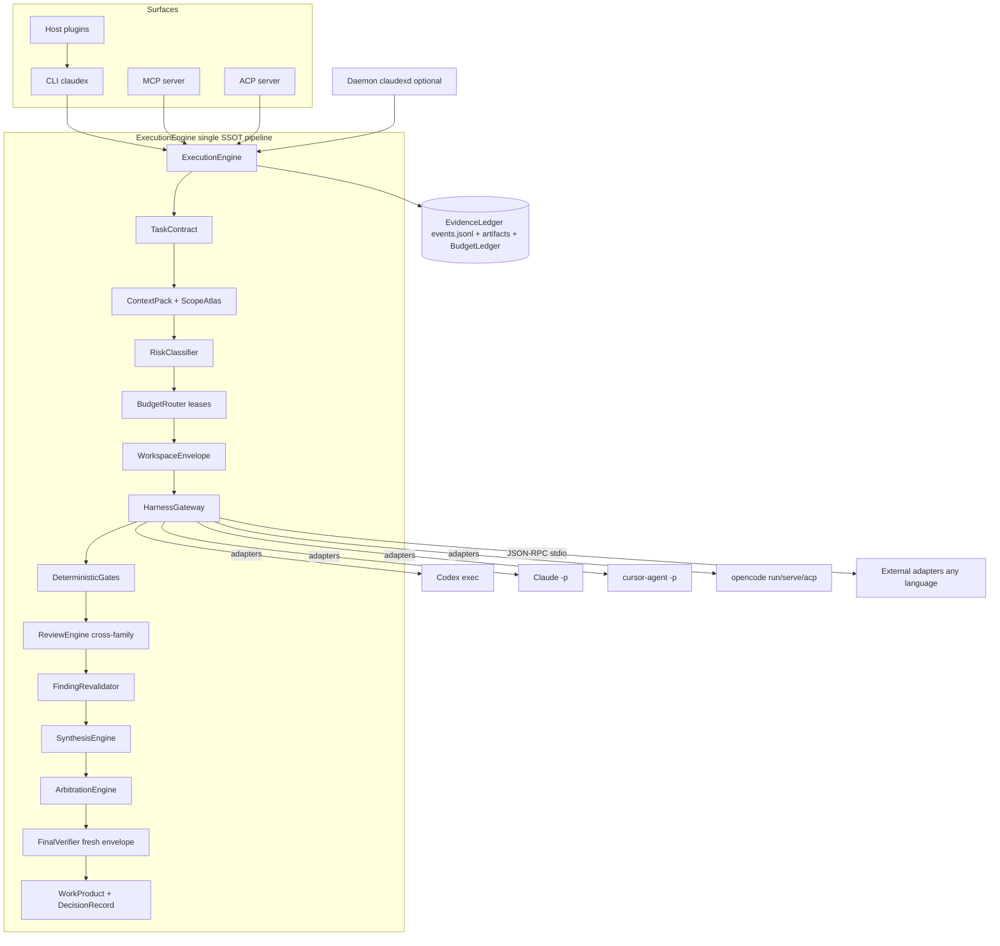

# Claudex v1.0 — Build Plan

> Current execution note: the active v0.4.0 beta product truth is captured by
> [`../CLAUDEX_BIBLE.md`](../CLAUDEX_BIBLE.md), [`ARCHITECTURE.md`](ARCHITECTURE.md),
> and [`DESIGN_SYSTEM.md`](DESIGN_SYSTEM.md). `PLAN_V0_3_0.md` remains historical.
> Product invariants live in
> [`../CLAUDEX_BIBLE.md`](../CLAUDEX_BIBLE.md). This file remains a historical
> broad plan and must not override the current canonical mode ids or v0.4
> decisions.

> Historical scope note: this plan originally described an eight-mode v1.0
> taxonomy. Current v0.4.0 canonical mode ids are `ask`, `explore`, `agent`,
> `best_of_n`, `max_attempts`, `until_clean`, `plan`, `create`, `readonly_audit`, and
> `benchmark`. Old ids from this historical plan are not compatibility aliases.

Harness-agnostic, local-first, evidence-driven development control plane. Orchestrates Codex / Claude Code / Cursor CLI / OpenCode (and future harnesses) as interchangeable *harnesses* — no privileged harness, no hardcoded roles. Collapses cleanly to a single native harness when only one is configured.

> Codename **Claudex** (binary/package name kept abstract; run a naming gate before any public release — "claudex"/"codex" proximity + collisions). TypeScript/Node, breadth-first full v1.0, with a reproducible SWE-bench Verified runner, embeddable so Ouroboros can replace its `claude_code.py`.

---

## 1. Locked decisions (from quiz)

- **Name/brand**: Claudex. **Repo**: Claudex product repository; public/private
  hosting is a release decision, not a runtime contract. **License**: MIT.
- **Runtime**: TypeScript/Node core; language-agnostic boundary (CLI `--json` + JSON-RPC-over-stdio + MCP) so Python (Ouroboros) consumes it.
- **Scope**: breadth-first full v1.0 control-plane surface. **Priority**: top-tier coding quality across harnesses.
- **Ouroboros**: design the embeddable substrate API now; Ouroboros is the first integration testbed.
- **Tooling**: pnpm + Turborepo + Changesets; Zod schemas → generated JSON Schema; Vitest; ESM; Node LTS; npm-first distribution.
- **SSOT**: files-first canonical (`.claudex/` JSONL events + YAML/JSON artifacts), optional rebuildable SQLite index.
- **Isolation**: git worktree + per-attempt env/HOME/harness-config-dir + port allocation; containers optional/scaffolded.
- **Arbitration**: evidence-weighted first, LLM-judge consilium only as grounded tiebreak/synthesis-decider.
- **Agent delivery default**: native direct-edit parity; envelope/artifact modes for best_of_n/benchmark.
- **Review**: reuse + generalize the `.adversarial-review/` evidence-packet substrate for ALL review; **always cross-family ≥2 distinct providers**; mandatory LLM-first FindingRevalidator (no evidence → cannot BLOCK); full convergence predicate; RouteProof always recorded + enforced in benchmark/high-risk; port Ouroboros Scope Atlas + omission accounting (no silent truncation); readiness-debt anti-thrash + round cap.
- **Access default**: `workspace_write`; thin policy layer leaning on native harness permissions + secret redaction; typed+LLM risk classifier; full apply UX; versioned repo config can NEVER self-grant sensitive powers.
- **Modes**: historical v1.0 set, now updated in v0.4.0 to 10 canonical modes. Plan mode: multi-harness planning → adversarial plan review → ambiguity extraction → user interview → freeze SpecPack. Create is canonical but currently shares the race/envelope pipeline; full `new_repo` materialization is target architecture. CLI has broad surface; full `--json` coverage for every subcommand remains target architecture.
- **Coding standards**: strict TS + typed errors (no swallow); looser LOC limits.

## 2. Defaulted decisions (skipped Batch 6 + Batch 7)

- **Claude adapter**: CLI headless primary (`claude -p` stream-json; `--bare` for reproducible bench); `claude-agent-sdk` added later for structured hooks/path-guards.
- **Adapter tiers**: Codex + Claude + Cursor + OpenCode **all first-class** (all pass conformance), plus a fake-harness suite + a raw-API harness.
- **Conformance**: `claudex doctor` probes each capability and gates which roles a degraded adapter may play.
- **Auth/secrets**: (1) `local_session` — rely on each harness's own native login/credential store; (2) `api_key` — Claudex-managed, mirroring harnesses (OS keychain where available else `0600` file = "auto", env + helper-command for CI, scoped per-envelope config dirs). No SaaS OAuth broker.
- **Budget**: pre-call lease **reservation** + prompt-fingerprint loop detection + recursion caps + 3-tier circuit breaker; dollar-based with child sub-budgets; observed/native best-effort subscription signals.
- **Multi-agent gating**: scale to complexity/risk/value.
- **Benchmarks**: runner abstraction + **SWE-bench Verified** first; Terminal-Bench 2.1 / OSWorld / ProgramBench scaffolded. Internal best-of-n selection uses a held-out test split to resist reward hacking.
- **Integration**: CLI + optional daemon + MCP server + ACP server + thin host plugins with one-line install.

## 3. Architecture

**Monorepo packages** (`packages/`): `schema`, `core`, `cli`, `daemon`, `config`, `artifact-store`, `event-log`, `policy`, `workspace`, `budget`, `gateway`, `adapter-protocol`, `context`, `review`, `arbitration`, `synthesis`, `benchmark`, `harness-codex`, `harness-claude`, `harness-cursor`, `harness-opencode`, `harness-raw-api`, `harness-fake`, `mcp-server`, `acp-server`, `plugin-*`.

> The numbered build phases (Phase 0 – Phase 12) and acceptance criteria live in the historical project plan and [docs/SPEC.md](SPEC.md). Active canonical scope for the beta is `CLAUDEX_BIBLE.md`, `docs/ARCHITECTURE.md`, and `docs/DESIGN_SYSTEM.md`; `docs/SPEC.md` remains long-term context only.
